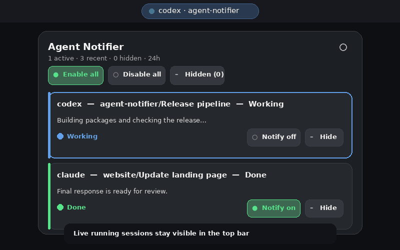

# Agent Notifier

[](https://github.com/MrMohebi/agent-notifier/actions/workflows/ci.yml)
[](https://github.com/MrMohebi/agent-notifier/actions/workflows/release.yml)
[](LICENSE)
[](extension/metadata.json)

Agent Notifier is a GNOME Shell extension and local Rust companion for monitoring Codex and Claude Code sessions. It keeps active sessions visible in the top bar, shows a compact 24-hour activity view, and can send completion, attention, and failure alerts to ntfy or authenticated webhooks.



## Features

- Live Codex and Claude Code session chips in the GNOME top bar.
- Blinking blue working status, red attention/failure status, and temporary green completion status.
- Compact cards with project, title, response/question preview, state, and relative time.
- Large per-session **Copy resume**, **Notify on/off**, and **Hide/Restore** controls.
- Quick **Enable all**, **Disable all**, and **Hidden sessions** actions.
- Notifications are off by default. Global and per-session choices persist across reboots.
- Optional ntfy and generic bearer-authenticated webhook destinations.
- Libadwaita preferences for destinations, tests, service health, and display windows.
- Secret Service storage for bearer tokens; secrets never enter GNOME Shell or the config file.
- Additive, backed-up, idempotent Codex and Claude Code hook installation.
- Local SQLite history with redacted previews and a rolling 24-hour retention window.
- Atomic disk spooling when the session D-Bus is temporarily unavailable.

Agent Notifier is informational only. It can copy a safe CLI resume command, but it never executes that command, answers a question, approves a permission request, or controls either agent.

## How it works

```text
Codex / Claude hooks
        │ JSON events
        ▼
Rust companion ─── SQLite session history
        │                    │
        │ D-Bus              └── redacted 500-character previews
        ▼
GNOME extension
        │
        ├── top-bar status and popup
        └── ntfy / webhook delivery from the companion
```

The Shell extension is deliberately lightweight. File parsing, persistence, credentials, and network traffic remain in the companion service.

## Requirements

- Linux with GNOME Shell 45, 46, 47, 48, or 49.
- A systemd user session and session D-Bus.
- GNOME Keyring or another Secret Service provider for authenticated destinations.
- Codex CLI and/or Claude Code with local hook support.
- For source builds: Rust 1.88 or newer, a C toolchain, `glib-compile-schemas`, and `zip`.

The extension currently targets GNOME Shell 45–49. GNOME Shell 46 is the primary development environment; reports and compatibility fixes for the other declared versions are welcome.

## Install

### User-local release archive (recommended)

Download these files from the [latest GitHub release](https://github.com/MrMohebi/agent-notifier/releases/latest):

- `agent-notifier-VERSION-linux-x86_64.tar.gz`
- `SHA256SUMS`

Then run:

```sh
sha256sum -c SHA256SUMS --ignore-missing
tar -xzf agent-notifier-*-linux-x86_64.tar.gz
cd agent-notifier-*-linux-x86_64
./install.sh
```

The installer places everything under `~/.local`, starts the user service, and installs the Codex and Claude hooks. Log out and back in once, then enable the extension:

```sh
gnome-extensions enable agent-notifier@mmmohebi.github.io
```

GNOME Shell on Wayland cannot reload changed extension JavaScript without a logout/login cycle.

### Debian or Ubuntu package

Download the `.deb` and `agent-notifier-shell-extension-VERSION.zip` from the same release:

```sh
sudo apt install ./agent-notifier_VERSION_amd64.deb
gnome-extensions install --force ./agent-notifier-shell-extension-VERSION.zip
systemctl --user enable --now agent-notifier.service
agent-notifier setup
agent-notifier setup --apply --binary /usr/libexec/agent-notifier
```

The first `setup` command is a preview. The second applies the hook changes. Log out and back in, then enable the extension.

### Fedora or RPM-based distribution

Download the `.rpm` and extension ZIP:

```sh
sudo dnf install ./agent-notifier-VERSION-1.x86_64.rpm
gnome-extensions install --force ./agent-notifier-shell-extension-VERSION.zip
systemctl --user enable --now agent-notifier.service
agent-notifier setup
agent-notifier setup --apply --binary /usr/libexec/agent-notifier
```

Log out and back in, then enable the extension.

### Build from source

```sh
git clone git@github.com:MrMohebi/agent-notifier.git
cd agent-notifier
cargo test --locked
cargo build --release --locked
./scripts/install-user.sh target/release/agent-notifier
```

The source installer:

1. Installs the companion in `~/.local/libexec` and links it into `~/.local/bin`.
2. Installs D-Bus activation and the systemd user service.
3. Copies and compiles the GNOME extension.
4. Starts the companion service.
5. Adds Agent Notifier hooks without replacing unrelated settings.

Existing Codex and Claude settings receive timestamped backups before they are changed.

## First use

1. Click the Agent Notifier item in the top bar.
2. Use **Enable all** to alert for every current and future session, or use **Notify on** for selected sessions.
3. Open the gear button to configure an ntfy or webhook destination.
4. Save the destination, then use **Send test**.
5. Start a new Codex or Claude Code turn and watch its state update.

Use **Copy resume** on a session card to copy `codex resume SESSION_ID` or `claude --resume SESSION_ID` without closing the popup.

Notifications are disabled by default. Enabling or disabling all sessions becomes the persistent default for sessions created after the next boot as well. An individual session can still override that default.

Hidden sessions remain in the local database. Open **Hidden (N)** and select **Restore** to bring one back. Hiding does not mute a session; use **Notify off** separately when needed.

## Session states

| State | Meaning | Top-bar behavior | Alert by default when enabled |
|---|---|---|---|
| `unknown` | Imported history or a newly discovered session | Popup only | No |
| `working` | A prompt was submitted or background work remains | Blinking blue dot | No |
| `needs_attention` | Input, permission, or another response is required | Red dot | Yes |
| `completed` | The turn produced its final response | Green dot for 10 minutes by default | Yes |
| `failed` | Claude `StopFailure` or an explicit failure was received | Red dot temporarily | Yes |
| `ended` | The session was interrupted or terminated | Popup only | No |

The recent-session window defaults to 24 hours. The green completion duration defaults to 10 minutes. Both are configurable in Preferences.

## Configure notifications

The Preferences window is recommended because it sends tokens directly to the companion over D-Bus. Tokens are stored through Secret Service and never returned to the extension.

### ntfy

Provide:

- A destination name.
- The server URL, such as `https://ntfy.sh` or a self-hosted server.
- The topic.
- An optional bearer token.

Equivalent CLI command:

```sh
agent-notifier configure personal \
  --kind ntfy \
  --endpoint https://ntfy.sh \
  --topic my-agent-alerts \
  --token 'optional-token'

agent-notifier test-notification personal
```

Be aware that command-line tokens may remain in shell history; Preferences avoids that exposure.

### Generic webhook

```sh
agent-notifier configure automation \
  --kind webhook \
  --endpoint https://example.com/agent-events \
  --token 'optional-bearer-token'

agent-notifier test-notification automation
```

Webhooks receive an HTTP `POST` with a versioned envelope:

```json
{
  "version": 1,
  "type": "session.state_changed",
  "session": {
    "id": "codex:session-id",
    "agent": "codex",
    "title": "Short session title",
    "project": "project-folder",
    "state": "completed",
    "preview": "Redacted response preview",
    "created_at": "2026-09-29T12:00:00Z",
    "updated_at": "2026-09-29T12:03:00Z",
    "live": true,
    "notifications_enabled": true,
    "hidden": false
  }
}
```

Destinations deliver independently. HTTP 429 and 5xx responses use bounded exponential retries. ntfy attention messages use high priority; other states use default priority.

## Commands

```text
agent-notifier daemon
agent-notifier hook codex|claude
agent-notifier setup [--apply] [--binary PATH]
agent-notifier uninstall [--binary PATH]
agent-notifier configure NAME --kind ntfy|webhook --endpoint URL [options]
agent-notifier remove-destination NAME
agent-notifier test-notification NAME
agent-notifier doctor
```

`setup` is a preview unless `--apply` is present. `uninstall` removes only hook commands carrying the Agent Notifier marker.

## Data and privacy

| Data | Location |
|---|---|
| Session database and offline spool | `$XDG_DATA_HOME/agent-notifier/` |
| Non-secret destination configuration | `$XDG_CONFIG_HOME/agent-notifier/config.toml` |
| Bearer tokens | Secret Service / GNOME Keyring |
| User systemd unit | `~/.config/systemd/user/agent-notifier.service` |
| User extension | `$XDG_DATA_HOME/gnome-shell/extensions/agent-notifier@mmmohebi.github.io/` |

Before storage or delivery, Agent Notifier removes terminal control sequences, normalizes whitespace, limits previews to 500 characters, and redacts common authorization headers, bearer tokens, API keys, passwords, tokens, and secrets.

Only local hooks and local history files are observed. Cloud-only sessions and remote aggregation are outside the current scope.

## Troubleshooting

### “Companion service is unavailable”

```sh
systemctl --user restart agent-notifier.service
systemctl --user status agent-notifier.service
agent-notifier doctor
journalctl --user-unit agent-notifier.service --since today
```

Confirm the session D-Bus service is visible:

```sh
gdbus call --session \
  --dest io.github.mmmohebi.AgentNotifier \
  --object-path /io/github/mmmohebi/AgentNotifier \
  --method io.github.mmmohebi.AgentNotifier1.GetServiceStatus
```

### The extension is installed but missing from the top bar

```sh
gnome-extensions info agent-notifier@mmmohebi.github.io
gnome-extensions enable agent-notifier@mmmohebi.github.io
```

Log out and back in after installing or updating on Wayland. Check extension errors with:

```sh
gdbus call --session \
  --dest org.gnome.Shell \
  --object-path /org/gnome/Shell \
  --method org.gnome.Shell.Extensions.GetExtensionErrors \
  agent-notifier@mmmohebi.github.io
```

### Sessions do not update

Preview the hook installation, then reapply it:

```sh
agent-notifier setup
agent-notifier setup --apply
```

Review the generated entries in `~/.codex/hooks.json` and `~/.claude/settings.json`. Codex may require explicit trust for newly added local hooks.

### Notifications do not arrive

Check all four conditions:

1. The session says **Notify on**, or **Enable all** was selected.
2. The destination is enabled in Preferences.
3. **Send test** succeeds.
4. A Secret Service provider is available when using a token.

Starting work does not send an alert. Agent Notifier alerts only for attention, completion, and failure states.

## Uninstall

Remove Agent Notifier hooks first:

```sh
agent-notifier uninstall
systemctl --user disable --now agent-notifier.service
gnome-extensions uninstall agent-notifier@mmmohebi.github.io
```

For a system package, then run `sudo apt remove agent-notifier` or `sudo dnf remove agent-notifier`. For a user-local installation, remove the installed binary, symlink, D-Bus service, and systemd user unit from the paths listed above.

The session database, destination metadata, and Secret Service entries are intentionally retained to prevent accidental data loss. Remove them manually only if you also want to erase saved state and credentials.

## Development

```sh
make test
make check
make release
make extension
```

Regenerate the README preview with Pillow installed:

```sh
./scripts/create-preview-gif.py assets/agent-notifier-preview.gif
```

Run a complete local package build on Debian/Ubuntu with `dpkg-deb` and `rpmbuild` installed:

```sh
cargo build --release --locked
./scripts/build-release-packages.sh 0.1.3
```

## CI and releases

Every push to `main` and every pull request runs formatting, Clippy, Rust tests, JavaScript syntax checks, GSettings validation, a release build, and extension archive verification.

Tags matching `v*` run the release workflow and publish:

- GNOME extension ZIP.
- User-local Linux x86-64 archive.
- Debian/Ubuntu `.deb`.
- Fedora/RPM `.rpm`.
- SHA-256 checksums.
- GitHub/Sigstore build-provenance attestations.

To release:

```sh
git tag -s v0.1.3 -m 'Agent Notifier 0.1.3'
git push origin v0.1.3
```

Verify downloaded artifacts:

```sh
sha256sum -c SHA256SUMS
gh attestation verify agent-notifier-0.1.3-linux-x86_64.tar.gz \
  --repo MrMohebi/agent-notifier
```

## Contributing

Issues and pull requests are welcome at [github.com/MrMohebi/agent-notifier](https://github.com/MrMohebi/agent-notifier). Please include your GNOME Shell version and distribution when reporting UI or packaging problems.

## License

Agent Notifier is licensed under [GPL-3.0-or-later](LICENSE).
